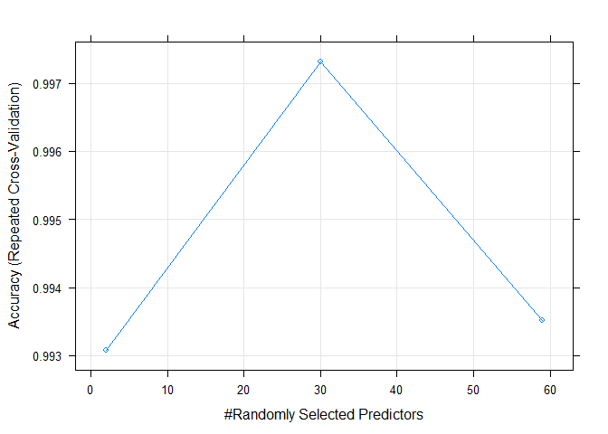
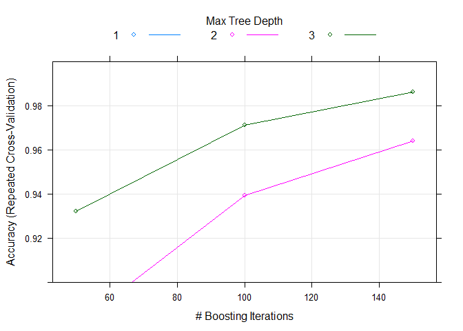

# Practical Machine Learning - Course project
Per Linde  
4 oktober 2017  


```r
library(tidyverse)
library(lubridate)
library(caret)
```


### Introduction
This is my course project for the Coursera class "Practical Machine Learning" by Johns Hopkins University. The goal of the exercise is to predict the manner in which exercise was performed. There are five different manners in which the exercise could be performed, labeled as A, B, C, D, E. The data for the project come from [this](http://web.archive.org/web/20161224072740/http:/groupware.les.inf.puc-rio.br/har) source.

### Data cleansing
First I will read the data. The code here assumes that the data is already downloaded and in the working directory of the project. The training data file will be read into the variable "training" whereas the final 20 observations that will be predicted in the end are put in the variable "validation", as I will later split the training data into a training and a testing set.

```r
training <- read.csv("pml-training.csv", na.strings=c("NA","#DIV/0!",""))

validation <- read.csv("pml-testing.csv", na.strings=c("NA","#DIV/0!",""))
```

After reading in the data I call the dim command to get a sense of how big the data is. 

```r
dim(training)
```

```
## [1] 19622   160
```
So we have over 19600 observations and 160 variables, including the variable we are trying to predict. Now let´s use the str function to see what the data looks like.

```r
str(training)
```

```
## 'data.frame':	19622 obs. of  160 variables:
##  $ X                       : int  1 2 3 4 5 6 7 8 9 10 ...
##  $ user_name               : Factor w/ 6 levels "adelmo","carlitos",..: 2 2 2 2 2 2 2 2 2 2 ...
##  $ raw_timestamp_part_1    : int  1323084231 1323084231 1323084231 1323084232 1323084232 1323084232 1323084232 1323084232 1323084232 1323084232 ...
##  $ raw_timestamp_part_2    : int  788290 808298 820366 120339 196328 304277 368296 440390 484323 484434 ...
##  $ cvtd_timestamp          : Factor w/ 20 levels "02/12/2011 13:32",..: 9 9 9 9 9 9 9 9 9 9 ...
##  $ new_window              : Factor w/ 2 levels "no","yes": 1 1 1 1 1 1 1 1 1 1 ...
##  $ num_window              : int  11 11 11 12 12 12 12 12 12 12 ...
##  $ roll_belt               : num  1.41 1.41 1.42 1.48 1.48 1.45 1.42 1.42 1.43 1.45 ...
##  $ pitch_belt              : num  8.07 8.07 8.07 8.05 8.07 8.06 8.09 8.13 8.16 8.17 ...
##  $ yaw_belt                : num  -94.4 -94.4 -94.4 -94.4 -94.4 -94.4 -94.4 -94.4 -94.4 -94.4 ...
##  $ total_accel_belt        : int  3 3 3 3 3 3 3 3 3 3 ...
##  $ kurtosis_roll_belt      : num  NA NA NA NA NA NA NA NA NA NA ...
##  $ kurtosis_picth_belt     : num  NA NA NA NA NA NA NA NA NA NA ...
##  $ kurtosis_yaw_belt       : logi  NA NA NA NA NA NA ...
##  $ skewness_roll_belt      : num  NA NA NA NA NA NA NA NA NA NA ...
##  $ skewness_roll_belt.1    : num  NA NA NA NA NA NA NA NA NA NA ...
##  $ skewness_yaw_belt       : logi  NA NA NA NA NA NA ...
##  $ max_roll_belt           : num  NA NA NA NA NA NA NA NA NA NA ...
##  $ max_picth_belt          : int  NA NA NA NA NA NA NA NA NA NA ...
##  $ max_yaw_belt            : num  NA NA NA NA NA NA NA NA NA NA ...
##  $ min_roll_belt           : num  NA NA NA NA NA NA NA NA NA NA ...
##  $ min_pitch_belt          : int  NA NA NA NA NA NA NA NA NA NA ...
##  $ min_yaw_belt            : num  NA NA NA NA NA NA NA NA NA NA ...
##  $ amplitude_roll_belt     : num  NA NA NA NA NA NA NA NA NA NA ...
##  $ amplitude_pitch_belt    : int  NA NA NA NA NA NA NA NA NA NA ...
##  $ amplitude_yaw_belt      : num  NA NA NA NA NA NA NA NA NA NA ...
##  $ var_total_accel_belt    : num  NA NA NA NA NA NA NA NA NA NA ...
##  $ avg_roll_belt           : num  NA NA NA NA NA NA NA NA NA NA ...
##  $ stddev_roll_belt        : num  NA NA NA NA NA NA NA NA NA NA ...
##  $ var_roll_belt           : num  NA NA NA NA NA NA NA NA NA NA ...
##  $ avg_pitch_belt          : num  NA NA NA NA NA NA NA NA NA NA ...
##  $ stddev_pitch_belt       : num  NA NA NA NA NA NA NA NA NA NA ...
##  $ var_pitch_belt          : num  NA NA NA NA NA NA NA NA NA NA ...
##  $ avg_yaw_belt            : num  NA NA NA NA NA NA NA NA NA NA ...
##  $ stddev_yaw_belt         : num  NA NA NA NA NA NA NA NA NA NA ...
##  $ var_yaw_belt            : num  NA NA NA NA NA NA NA NA NA NA ...
##  $ gyros_belt_x            : num  0 0.02 0 0.02 0.02 0.02 0.02 0.02 0.02 0.03 ...
##  $ gyros_belt_y            : num  0 0 0 0 0.02 0 0 0 0 0 ...
##  $ gyros_belt_z            : num  -0.02 -0.02 -0.02 -0.03 -0.02 -0.02 -0.02 -0.02 -0.02 0 ...
##  $ accel_belt_x            : int  -21 -22 -20 -22 -21 -21 -22 -22 -20 -21 ...
##  $ accel_belt_y            : int  4 4 5 3 2 4 3 4 2 4 ...
##  $ accel_belt_z            : int  22 22 23 21 24 21 21 21 24 22 ...
##  $ magnet_belt_x           : int  -3 -7 -2 -6 -6 0 -4 -2 1 -3 ...
##  $ magnet_belt_y           : int  599 608 600 604 600 603 599 603 602 609 ...
##  $ magnet_belt_z           : int  -313 -311 -305 -310 -302 -312 -311 -313 -312 -308 ...
##  $ roll_arm                : num  -128 -128 -128 -128 -128 -128 -128 -128 -128 -128 ...
##  $ pitch_arm               : num  22.5 22.5 22.5 22.1 22.1 22 21.9 21.8 21.7 21.6 ...
##  $ yaw_arm                 : num  -161 -161 -161 -161 -161 -161 -161 -161 -161 -161 ...
##  $ total_accel_arm         : int  34 34 34 34 34 34 34 34 34 34 ...
##  $ var_accel_arm           : num  NA NA NA NA NA NA NA NA NA NA ...
##  $ avg_roll_arm            : num  NA NA NA NA NA NA NA NA NA NA ...
##  $ stddev_roll_arm         : num  NA NA NA NA NA NA NA NA NA NA ...
##  $ var_roll_arm            : num  NA NA NA NA NA NA NA NA NA NA ...
##  $ avg_pitch_arm           : num  NA NA NA NA NA NA NA NA NA NA ...
##  $ stddev_pitch_arm        : num  NA NA NA NA NA NA NA NA NA NA ...
##  $ var_pitch_arm           : num  NA NA NA NA NA NA NA NA NA NA ...
##  $ avg_yaw_arm             : num  NA NA NA NA NA NA NA NA NA NA ...
##  $ stddev_yaw_arm          : num  NA NA NA NA NA NA NA NA NA NA ...
##  $ var_yaw_arm             : num  NA NA NA NA NA NA NA NA NA NA ...
##  $ gyros_arm_x             : num  0 0.02 0.02 0.02 0 0.02 0 0.02 0.02 0.02 ...
##  $ gyros_arm_y             : num  0 -0.02 -0.02 -0.03 -0.03 -0.03 -0.03 -0.02 -0.03 -0.03 ...
##  $ gyros_arm_z             : num  -0.02 -0.02 -0.02 0.02 0 0 0 0 -0.02 -0.02 ...
##  $ accel_arm_x             : int  -288 -290 -289 -289 -289 -289 -289 -289 -288 -288 ...
##  $ accel_arm_y             : int  109 110 110 111 111 111 111 111 109 110 ...
##  $ accel_arm_z             : int  -123 -125 -126 -123 -123 -122 -125 -124 -122 -124 ...
##  $ magnet_arm_x            : int  -368 -369 -368 -372 -374 -369 -373 -372 -369 -376 ...
##  $ magnet_arm_y            : int  337 337 344 344 337 342 336 338 341 334 ...
##  $ magnet_arm_z            : int  516 513 513 512 506 513 509 510 518 516 ...
##  $ kurtosis_roll_arm       : num  NA NA NA NA NA NA NA NA NA NA ...
##  $ kurtosis_picth_arm      : num  NA NA NA NA NA NA NA NA NA NA ...
##  $ kurtosis_yaw_arm        : num  NA NA NA NA NA NA NA NA NA NA ...
##  $ skewness_roll_arm       : num  NA NA NA NA NA NA NA NA NA NA ...
##  $ skewness_pitch_arm      : num  NA NA NA NA NA NA NA NA NA NA ...
##  $ skewness_yaw_arm        : num  NA NA NA NA NA NA NA NA NA NA ...
##  $ max_roll_arm            : num  NA NA NA NA NA NA NA NA NA NA ...
##  $ max_picth_arm           : num  NA NA NA NA NA NA NA NA NA NA ...
##  $ max_yaw_arm             : int  NA NA NA NA NA NA NA NA NA NA ...
##  $ min_roll_arm            : num  NA NA NA NA NA NA NA NA NA NA ...
##  $ min_pitch_arm           : num  NA NA NA NA NA NA NA NA NA NA ...
##  $ min_yaw_arm             : int  NA NA NA NA NA NA NA NA NA NA ...
##  $ amplitude_roll_arm      : num  NA NA NA NA NA NA NA NA NA NA ...
##  $ amplitude_pitch_arm     : num  NA NA NA NA NA NA NA NA NA NA ...
##  $ amplitude_yaw_arm       : int  NA NA NA NA NA NA NA NA NA NA ...
##  $ roll_dumbbell           : num  13.1 13.1 12.9 13.4 13.4 ...
##  $ pitch_dumbbell          : num  -70.5 -70.6 -70.3 -70.4 -70.4 ...
##  $ yaw_dumbbell            : num  -84.9 -84.7 -85.1 -84.9 -84.9 ...
##  $ kurtosis_roll_dumbbell  : num  NA NA NA NA NA NA NA NA NA NA ...
##  $ kurtosis_picth_dumbbell : num  NA NA NA NA NA NA NA NA NA NA ...
##  $ kurtosis_yaw_dumbbell   : logi  NA NA NA NA NA NA ...
##  $ skewness_roll_dumbbell  : num  NA NA NA NA NA NA NA NA NA NA ...
##  $ skewness_pitch_dumbbell : num  NA NA NA NA NA NA NA NA NA NA ...
##  $ skewness_yaw_dumbbell   : logi  NA NA NA NA NA NA ...
##  $ max_roll_dumbbell       : num  NA NA NA NA NA NA NA NA NA NA ...
##  $ max_picth_dumbbell      : num  NA NA NA NA NA NA NA NA NA NA ...
##  $ max_yaw_dumbbell        : num  NA NA NA NA NA NA NA NA NA NA ...
##  $ min_roll_dumbbell       : num  NA NA NA NA NA NA NA NA NA NA ...
##  $ min_pitch_dumbbell      : num  NA NA NA NA NA NA NA NA NA NA ...
##  $ min_yaw_dumbbell        : num  NA NA NA NA NA NA NA NA NA NA ...
##  $ amplitude_roll_dumbbell : num  NA NA NA NA NA NA NA NA NA NA ...
##   [list output truncated]
```
  
  There seems to be several columns that mainly contain NAs. Let´s identify all columns that have more than 19000 NAs and remove them from the training data set.

```r
nas <- apply(training, 2, function(x) sum(is.na(x)))
naCols <- names(nas[nas > 19000])
naColIndex <- which(colnames(training) %in% naCols)
training <- training[, -naColIndex]
apply(training, 2, function(x) sum(is.na(x)))
```

```
##                    X            user_name raw_timestamp_part_1 
##                    0                    0                    0 
## raw_timestamp_part_2       cvtd_timestamp           new_window 
##                    0                    0                    0 
##           num_window            roll_belt           pitch_belt 
##                    0                    0                    0 
##             yaw_belt     total_accel_belt         gyros_belt_x 
##                    0                    0                    0 
##         gyros_belt_y         gyros_belt_z         accel_belt_x 
##                    0                    0                    0 
##         accel_belt_y         accel_belt_z        magnet_belt_x 
##                    0                    0                    0 
##        magnet_belt_y        magnet_belt_z             roll_arm 
##                    0                    0                    0 
##            pitch_arm              yaw_arm      total_accel_arm 
##                    0                    0                    0 
##          gyros_arm_x          gyros_arm_y          gyros_arm_z 
##                    0                    0                    0 
##          accel_arm_x          accel_arm_y          accel_arm_z 
##                    0                    0                    0 
##         magnet_arm_x         magnet_arm_y         magnet_arm_z 
##                    0                    0                    0 
##        roll_dumbbell       pitch_dumbbell         yaw_dumbbell 
##                    0                    0                    0 
## total_accel_dumbbell     gyros_dumbbell_x     gyros_dumbbell_y 
##                    0                    0                    0 
##     gyros_dumbbell_z     accel_dumbbell_x     accel_dumbbell_y 
##                    0                    0                    0 
##     accel_dumbbell_z    magnet_dumbbell_x    magnet_dumbbell_y 
##                    0                    0                    0 
##    magnet_dumbbell_z         roll_forearm        pitch_forearm 
##                    0                    0                    0 
##          yaw_forearm  total_accel_forearm      gyros_forearm_x 
##                    0                    0                    0 
##      gyros_forearm_y      gyros_forearm_z      accel_forearm_x 
##                    0                    0                    0 
##      accel_forearm_y      accel_forearm_z     magnet_forearm_x 
##                    0                    0                    0 
##     magnet_forearm_y     magnet_forearm_z               classe 
##                    0                    0                    0
```
  
  The remaining variables are actually free from NAs. Now before fitting any models, let´s remove a few timestamp columns that will not be used in the prediction.

```r
training <- training[, -c(1, 3, 4, 5)]
```
  
  Now let´s look at the dimensions of the data once again.

```r
dim(training)
```

```
## [1] 19622    56
```
### Model
 Let´s start modelling. First I´ll randomly split the data in the training variable into a training and a test set, where the test set will be used to estimate the out of sample test error. 70% of the data in the training variable will be used as training data, and the remaining 30% as test data. Note that the variable training from now on will continue only the training data, and that the test data will be in the testing variable.   

### Model

```r
set.seed(1337)
trainIndex <- createDataPartition(training$classe, p=0.7, list=FALSE)
trainTrain <- training[trainIndex, ]
testing <- training[-trainIndex, ]
training <- trainTrain
rm(trainTrain)
```
  
  Before fitting the models I´ll set up the cross validation that will be used when fitting all models. Here, 10-fold cross validation will be used, repeated once.


```r
cv <- trainControl(method = "repeatedcv",
                           number = 10, repeats=1)
```
  
  Now let´s start modelling. I´ll be fitting three separate models on the training data that will be evaluated on the test data, and the best model out of the three will then be used to predict the 20 observations in the validation set.    
  
  The models I´ll be fititng are the Naive Bayes classifier, Random forest and Gradient Boosting. Let´s start with the Naive Bayes classifier.

```r
nbFit <- train(classe ~ ., data=training, method='nb',trControl=cv)
```


```r
nbPrediction <- predict(nbFit, testing, type="raw")
confusionMatrix(nbPrediction, testing$classe)
```

```
## Confusion Matrix and Statistics
## 
##           Reference
## Prediction    A    B    C    D    E
##          A 1538  247  230  163   72
##          B   39  768   74    2  106
##          C   29   85  698  123   35
##          D   67   30   24  638   31
##          E    1    9    0   38  838
## 
## Overall Statistics
##                                           
##                Accuracy : 0.7613          
##                  95% CI : (0.7502, 0.7721)
##     No Information Rate : 0.2845          
##     P-Value [Acc > NIR] : < 2.2e-16       
##                                           
##                   Kappa : 0.694           
##  Mcnemar's Test P-Value : < 2.2e-16       
## 
## Statistics by Class:
## 
##                      Class: A Class: B Class: C Class: D Class: E
## Sensitivity            0.9188   0.6743   0.6803   0.6618   0.7745
## Specificity            0.8309   0.9534   0.9440   0.9691   0.9900
## Pos Pred Value         0.6836   0.7765   0.7196   0.8076   0.9458
## Neg Pred Value         0.9626   0.9242   0.9333   0.9360   0.9512
## Prevalence             0.2845   0.1935   0.1743   0.1638   0.1839
## Detection Rate         0.2613   0.1305   0.1186   0.1084   0.1424
## Detection Prevalence   0.3823   0.1681   0.1648   0.1342   0.1506
## Balanced Accuracy      0.8748   0.8139   0.8122   0.8155   0.8822
```

 When applied on the test set, the accuracy for the Naive Bayes model was just over 76% and the Kappa just below 70%.  
  Now let´s fit the Random forest.


```r
rfFit <- train(classe ~., data=training, method="rf", trControl=cv, prox=TRUE)
```


```r
rfPrediction <- predict(rfFit, testing, type="raw")
confusionMatrix(rfPrediction, testing$classe)
```

```
## Confusion Matrix and Statistics
## 
##           Reference
## Prediction    A    B    C    D    E
##          A 1674    3    0    0    0
##          B    0 1135    3    0    0
##          C    0    1 1021    4    0
##          D    0    0    2  960    2
##          E    0    0    0    0 1080
## 
## Overall Statistics
##                                           
##                Accuracy : 0.9975          
##                  95% CI : (0.9958, 0.9986)
##     No Information Rate : 0.2845          
##     P-Value [Acc > NIR] : < 2.2e-16       
##                                           
##                   Kappa : 0.9968          
##  Mcnemar's Test P-Value : NA              
## 
## Statistics by Class:
## 
##                      Class: A Class: B Class: C Class: D Class: E
## Sensitivity            1.0000   0.9965   0.9951   0.9959   0.9982
## Specificity            0.9993   0.9994   0.9990   0.9992   1.0000
## Pos Pred Value         0.9982   0.9974   0.9951   0.9959   1.0000
## Neg Pred Value         1.0000   0.9992   0.9990   0.9992   0.9996
## Prevalence             0.2845   0.1935   0.1743   0.1638   0.1839
## Detection Rate         0.2845   0.1929   0.1735   0.1631   0.1835
## Detection Prevalence   0.2850   0.1934   0.1743   0.1638   0.1835
## Balanced Accuracy      0.9996   0.9979   0.9970   0.9975   0.9991
```

```r
plot(rfFit)
```

<!-- -->
  
 The random forest yields a much higher accuracy of 99.75% and a Kappa of 0.9968. A 95% confidence interval of the accuracy is given by (0.9958, 0.9986).  
 Let´s try the final model using gbm. 


```r
gbmFit <- train(classe ~., data=training, method="gbm", trControl=cv, verbose=FALSE)
```


```r
gbmPrediction <- predict(gbmFit, testing, type="raw")
confusionMatrix(gbmPrediction, testing$classe)
```

```
## Confusion Matrix and Statistics
## 
##           Reference
## Prediction    A    B    C    D    E
##          A 1674   10    0    1    0
##          B    0 1123   19    9    5
##          C    0    6 1002    9    2
##          D    0    0    5  945    6
##          E    0    0    0    0 1069
## 
## Overall Statistics
##                                           
##                Accuracy : 0.9878          
##                  95% CI : (0.9846, 0.9904)
##     No Information Rate : 0.2845          
##     P-Value [Acc > NIR] : < 2.2e-16       
##                                           
##                   Kappa : 0.9845          
##  Mcnemar's Test P-Value : NA              
## 
## Statistics by Class:
## 
##                      Class: A Class: B Class: C Class: D Class: E
## Sensitivity            1.0000   0.9860   0.9766   0.9803   0.9880
## Specificity            0.9974   0.9930   0.9965   0.9978   1.0000
## Pos Pred Value         0.9935   0.9715   0.9833   0.9885   1.0000
## Neg Pred Value         1.0000   0.9966   0.9951   0.9961   0.9973
## Prevalence             0.2845   0.1935   0.1743   0.1638   0.1839
## Detection Rate         0.2845   0.1908   0.1703   0.1606   0.1816
## Detection Prevalence   0.2863   0.1964   0.1732   0.1624   0.1816
## Balanced Accuracy      0.9987   0.9895   0.9866   0.9890   0.9940
```

```r
plot(gbmFit, ylim=c(0.9, 1))
```

<!-- -->
  
  The gbm model is also very accurate, getting 98.78% of the predictions in the test sample correct. However, it is slightly less accurate than the random forest model. Hence, the random forest model will be used in the final predictions. The expected out of sample error rate is 1 - 0.9975 = 0.0025.
  
## Predicting on validation set
The last part of the task is to use the best model to generate predictions on the 20 observations in the validation data set. The code below cleans the valiation data to include only the same variables as the training and test data, and then performs the prediction.

```r
vars <- colnames(training)
varIndex <- which(colnames(validation) %in% vars)
validation <- validation[, varIndex]

valPred <- predict(rfFit, validation, type="raw")
valPred
```

```
##  [1] B A B A A E D B A A B C B A E E A B B B
## Levels: A B C D E
```


